# How to adorn your plots

### Introduction

This vignette provides best practices for applying OHA Data Viz colors
to visualizations using the `glitr` package.

### Getting Started

To get started, load the standard OHA-SI libraries used in analysis.

``` r
library(dplyr)
library(tidyr)
library(forcats)
library(purrr)
library(ggplot2)
library(glitr)
library(systemfonts)
library(scales)
library(ggtext)
library(patchwork)
library(sf)
```

``` r
# Take a look at what's inside the package
ls('package:glitr')
#>   [1] "%>%"                     "burnt_sienna"           
#>   [3] "burnt_sienna_light"      "cascade"                
#>   [5] "color_caption"           "color_gridline"         
#>   [7] "color_plot_text"         "color_title"            
#>   [9] "denim"                   "denim_light"            
#>  [11] "electric_indigo"         "electric_indigo_100"    
#>  [13] "electric_indigo_20"      "electric_indigo_40"     
#>  [15] "electric_indigo_60"      "electric_indigo_80"     
#>  [17] "genoa"                   "genoa_light"            
#>  [19] "golden_sand"             "golden_sand_light"      
#>  [21] "grey10k"                 "grey20k"                
#>  [23] "grey30k"                 "grey40k"                
#>  [25] "grey50k"                 "grey60k"                
#>  [27] "grey70k"                 "grey80k"                
#>  [29] "grey90k"                 "hfr_mmd"                
#>  [31] "hts"                     "hts_geo"                
#>  [33] "hunter"                  "hunter_100"             
#>  [35] "hunter_20"               "hunter_40"              
#>  [37] "hunter_60"               "hunter_80"              
#>  [39] "hw_electric_indigo"      "hw_hunter"              
#>  [41] "hw_lavender_haze"        "hw_midnight_blue"       
#>  [43] "hw_orchid_bloom"         "hw_slate"               
#>  [45] "hw_sun_kissed"           "hw_tango"               
#>  [47] "hw_viking"               "lavender_haze"          
#>  [49] "lavender_haze_100"       "lavender_haze_20"       
#>  [51] "lavender_haze_40"        "lavender_haze_60"       
#>  [53] "lavender_haze_80"        "light_grey"             
#>  [55] "matterhorn"              "midnight_blue"          
#>  [57] "midnight_blue_100"       "midnight_blue_20"       
#>  [59] "midnight_blue_40"        "midnight_blue_60"       
#>  [61] "midnight_blue_80"        "moody_blue"             
#>  [63] "moody_blue_light"        "nero"                   
#>  [65] "old_rose"                "old_rose_light"         
#>  [67] "orchid_bloom"            "orchid_bloom_100"       
#>  [69] "orchid_bloom_20"         "orchid_bloom_40"        
#>  [71] "orchid_bloom_60"         "orchid_bloom_80"        
#>  [73] "pantone_aqua_sky"        "pantone_blue_iris"      
#>  [75] "pantone_blue_turquoise"  "pantone_cerulean"       
#>  [77] "pantone_chili_pepper"    "pantone_classic_blue"   
#>  [79] "pantone_emerald"         "pantone_fuchsia_rose"   
#>  [81] "pantone_greenery"        "pantone_honeysuckle"    
#>  [83] "pantone_illuminating"    "pantone_living_coral"   
#>  [85] "pantone_marsala"         "pantone_mimosa"         
#>  [87] "pantone_mocha_mousse"    "pantone_peach_fuzz"     
#>  [89] "pantone_radiant_orchid"  "pantone_rose_quartz"    
#>  [91] "pantone_sand_dollar"     "pantone_serenity"       
#>  [93] "pantone_tangerine_tango" "pantone_tigerlily"      
#>  [95] "pantone_true_red"        "pantone_turquoise"      
#>  [97] "pantone_ultimate_gray"   "pantone_ultra_violet"   
#>  [99] "pantone_very_peri"       "pantone_viva_magenta"   
#> [101] "scale_color_si"          "scale_fill_si"          
#> [103] "scooter"                 "scooter_light"          
#> [105] "scooter_med"             "si_clear_preview"       
#> [107] "si_legend_color"         "si_legend_fill"         
#> [109] "si_palettes"             "si_preview"             
#> [111] "si_rampr"                "si_save"                
#> [113] "si_style"                "si_style_map"           
#> [115] "si_style_nolines"        "si_style_transparent"   
#> [117] "si_style_void"           "si_style_xgrid"         
#> [119] "si_style_xline"          "si_style_xyline"        
#> [121] "si_style_ygrid"          "si_style_yline"         
#> [123] "slate"                   "slate_100"              
#> [125] "slate_20"                "slate_40"               
#> [127] "slate_60"                "slate_80"               
#> [129] "sun_kissed"              "sun_kissed_100"         
#> [131] "sun_kissed_20"           "sun_kissed_40"          
#> [133] "sun_kissed_60"           "sun_kissed_80"          
#> [135] "suva_grey"               "tango"                  
#> [137] "tango_100"               "tango_20"               
#> [139] "tango_40"                "tango_60"               
#> [141] "tango_80"                "trolley_grey"           
#> [143] "trolley_grey_light"      "usaid_black"            
#> [145] "usaid_blue"              "usaid_darkgrey"         
#> [147] "usaid_lightblue"         "usaid_lightgrey"        
#> [149] "usaid_medblue"           "usaid_medgrey"          
#> [151] "usaid_red"               "viking"                 
#> [153] "viking_100"              "viking_20"              
#> [155] "viking_40"               "viking_60"              
#> [157] "viking_80"               "wapo_dblue"             
#> [159] "wapo_dmauve"             "wapo_dorange"           
#> [161] "wapo_lblue"              "wapo_lgreen"            
#> [163] "wapo_lmauve"             "wapo_lorange"           
#> [165] "wapo_lorange2"           "wapo_lpurple"           
#> [167] "wapo_pushpop"            "whisper"
```

The package can be divided into three main parts

1.  **colors**, that come as objects (such as `grey30k` or `hunter`),

2.  **SI themes**, that can be used to quickly apply SI plot defaults
    (family of `si_style*()` functions), and

3.  **helper functions**, that interpolate palettes or apply palettes to
    a visualization.

This vignette will focus on exploring colors and the SI themes.

### Colors

A number of pre-defined colors come with the `glitr` package. All
objects starting with `grey` belong to a family of gray colors where
`grey10k` is the lightest and `grey90k` the darkest. Objects starting
with `usaid_` are the official [USAID
colors](https://www.usaid.gov/node/194331) while those starting with
`wapo_` are Washington Post inspired colors. `siei_` colors are largely
out of style but included for posterity.
color\_`denote objects that can be used to for filling in captions, gridlines, plot text or plot titles. The family of`color\_\`
objects follows the colors recommended in the style guide.

``` r
# Colors belonging to greys, usaid_, wapo_ or siei_.
grep("(grey|siei_|wapo_|usaid_)", ls('package:glitr'), value = T)
#>  [1] "grey10k"            "grey20k"            "grey30k"           
#>  [4] "grey40k"            "grey50k"            "grey60k"           
#>  [7] "grey70k"            "grey80k"            "grey90k"           
#> [10] "light_grey"         "suva_grey"          "trolley_grey"      
#> [13] "trolley_grey_light" "usaid_black"        "usaid_blue"        
#> [16] "usaid_darkgrey"     "usaid_lightblue"    "usaid_lightgrey"   
#> [19] "usaid_medblue"      "usaid_medgrey"      "usaid_red"         
#> [22] "wapo_dblue"         "wapo_dmauve"        "wapo_dorange"      
#> [25] "wapo_lblue"         "wapo_lgreen"        "wapo_lmauve"       
#> [28] "wapo_lorange"       "wapo_lorange2"      "wapo_lpurple"      
#> [31] "wapo_pushpop"
```

The set of colors that is probably of most interest is the SIEI
recommended colors. As you may recall from the [Data Visualization Style
Guide](https://usaid-oha-si.github.io/styleguide/), the SI team has
created nine core colors:

-  midnight_blue
  (#15478A)
-  viking (#5BB5D5)
-  slate (#8C8C91)
-  electric_indigo
  (#3B5BBE)
-  orchid_bloom
  (#E14BA1)
-  sun_kissed
  (#F9C555)
-  hunter (#419164)
-  lavender_haze
  (#876EC4)
-  tango (#F36428)

``` r
# Any of these colors can be called by typing in the name of the color. 
# The `show_col` function is from the `scales` package and is a handy way to preview a color. 
show_col(hunter)
```

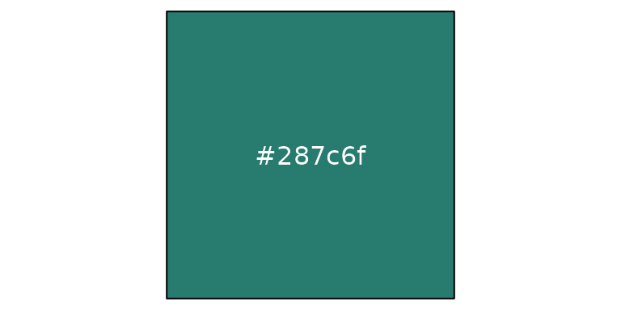

``` r
show_col(c(electric_indigo, orchid_bloom, sun_kissed, hunter, lavender_haze, tango), borders = F, ncol = 6)
```

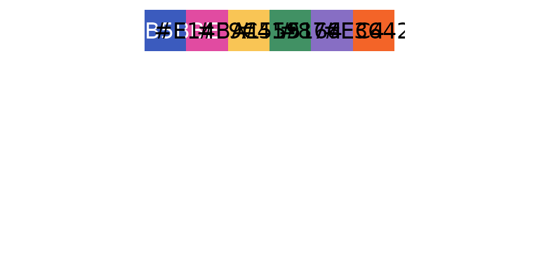

To access the full list of discrete or continuous palettes, see the
`si_palettes` list or call the color palette directly using the name
(`si_palettes$color_name`).

- OHA color names with a `_d` suffix (formerly singular),
  e.g. `midnight_blue_d` or `hunter_d`, are categorical palettes based
  on suggested color pairs.
- OHA color names with a `_c` suffix (formerly plural), e.g
  `lavender_haze_c` or `sun_kissed_c`, are continuous palettes that can
  be applied to continuous variables.
- OHA color names with a `_t` suffix, e.g. `viking_t` or `tango_t`, are
  tints of the the base color broken out by roughly a 20% increase in
  lightness.

If you attempt to apply a discrete palette to a continuous variable, the
color pairs will be recycled to the length of the vector you are
attempting to encode.

``` r
# Returns the recommended paired colors with hunter as the base
si_palettes$hunter_d %>% show_col(labels = F, borders = F, ncol = length(si_palettes$hunter_d))
```

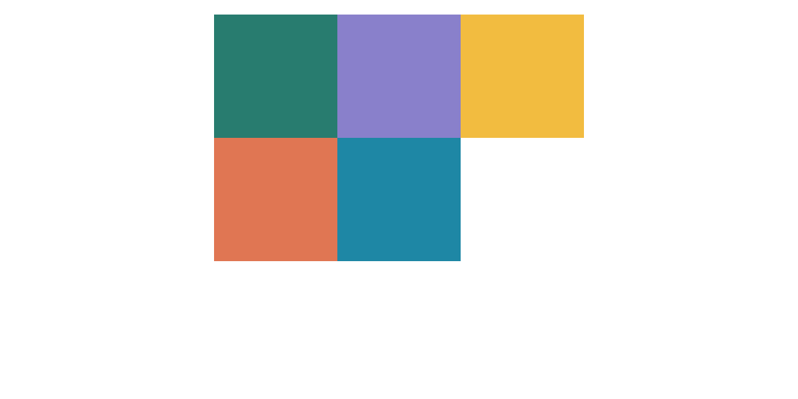

``` r

# Returns an set of vector of color values that increase the amount of lightness/white
si_palettes$hunter_t %>% show_col(labels = F, borders = F,  ncol = length(si_palettes$hunter_t))
```

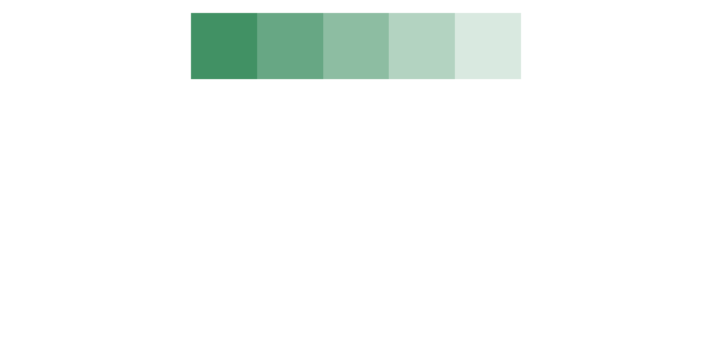

``` r

# Returns an interpolated vector of color values around the base hunter color
si_palettes$hunter_c %>% show_col(labels = F, borders = F,  ncol = length(si_palettes$hunter_c))
```

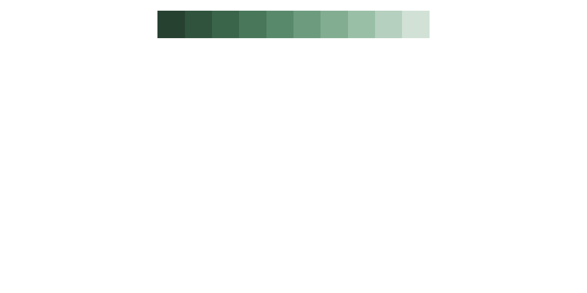

Finally, if you want to create a custom palette from one of the color
sets in the `si_palettes` list, you can do this using the
[`si_rampr()`](https://usaid-oha-si.github.io/glitr/reference/si_rampr.md)
function.

``` r
# si_rampr takes a palette name and the number of interpolated colors (n) you wish to return as arguments. 
tango_c_pal <- si_rampr(pal_name = "tango_c", n = 25)
tango_c_pal
#>  [1] "#65331E" "#6F371F" "#793B20" "#833F22" "#8D4425" "#964828" "#A04D2B"
#>  [8] "#A9532F" "#B25934" "#BA5F39" "#C2653E" "#CA6C44" "#D1734B" "#D87952"
#> [15] "#DE815A" "#E48962" "#EB916B" "#EF9975" "#F4A17F" "#F7AA8A" "#FAB396"
#> [22] "#FDBCA2" "#FDC5AF" "#FDCFBD" "#FDD9CB"

show_col(tango_c_pal, labels = F, borders = F)
```

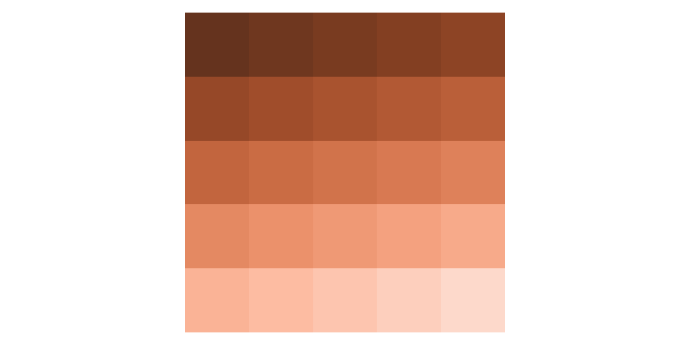

### Applying Colors

To add any of these colors to a graph, pass them as arguments in a
`ggplot2` call. We will work with one of the sample data sets to create
a bar graph where positive testing results are colored with
`electric_indigo`.

``` r
# Munge the hts data down to testing yields for a given year
  hts_bar <-
    hts %>%
    filter(period == "FY50", 
           period_type == "cumulative") %>%
    group_by(indicator, prime_partner_name) %>%
    summarise(total = sum(value, na.rm = TRUE),
              .groups = "drop") %>%
    pivot_wider(names_from = indicator, 
                values_from = total,
                names_glue = "{tolower(indicator)}") %>%
    mutate(positivity = (hts_tst_pos / hts_tst),
           prime_order = fct_reorder(prime_partner_name, hts_tst)) %>% 
  arrange(prime_order)

# Define testing results to be grey30k and positive results to be viking 
# Play close attention to where the fill is placed in the geom_col() call. 
# If placed inside the aesthetics, you will need to apply scale_fill_identity() to get the colors to render.
  p <- hts_bar %>% 
    ggplot(aes(y = prime_order)) +
    geom_col(aes(x = hts_tst), fill = grey30k) +
    geom_col(aes(x = hts_tst_pos), fill = midnight_blue) +
    labs(x = NULL, y = NULL, title = "HTS_TST_POS FILLED WITH MIDNIGHT BLUE COLOR",
         subtitle = "ggplot2 default settings",
         caption = "Source: glitr package `hts` dummy data")
  p
```

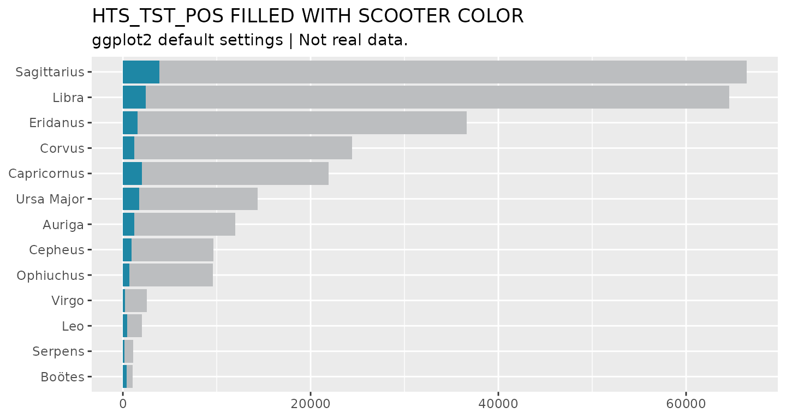

Another way to use colors in plots is to assign color values to a new
column in a data frame. For example, say we would like to highlight the
two partners that have conducted the greatest number of tests. First, we
will create a ranking variable that ranks partners by total testing.
Then we will assign a set of colors based on the rankings.

``` r
# Create a rank column, then assign colors based on threshold (<=2)
 hts_bar_rnkd <- hts_bar %>% 
  mutate(hts_rank = dense_rank(desc(hts_tst)), 
         rnk_color = case_when(
           hts_rank <= 2 ~ midnight_blue, 
           TRUE ~ viking
           )
         ) 
 hts_bar_rnkd %>% filter(hts_rank < 7)
#> # A tibble: 6 × 7
#>   prime_partner_name hts_tst hts_tst_pos positivity prime_order hts_rank
#>   <chr>                <dbl>       <dbl>      <dbl> <fct>          <int>
#> 1 Ursa Major           14360        1740     0.121  Ursa Major         6
#> 2 Capricornus          21920        2020     0.0922 Capricornus        5
#> 3 Corvus               24430        1240     0.0508 Corvus             4
#> 4 Eridanus             36620        1560     0.0426 Eridanus           3
#> 5 Libra                64580        2460     0.0381 Libra              2
#> 6 Sagittarius          66470        3870     0.0582 Sagittarius        1
#> # ℹ 1 more variable: rnk_color <chr>
 
 # Assign colors to top two ranked prime partners and plot.
 # Use the scale_fill_identity() to let ggplot2 know where fill is from.
 hts_bar_rnkd %>% 
   ggplot(aes(y = prime_order, x = hts_tst, fill = rnk_color)) +
   geom_col() +
   scale_fill_identity() +
      labs(x = NULL, y = NULL, title = "HTS_TST FILLED BASED ON IDENTITY",
         subtitle = "ggplot2 default settings",
         caption = "Source: glitr package `hts` dummy data")
```

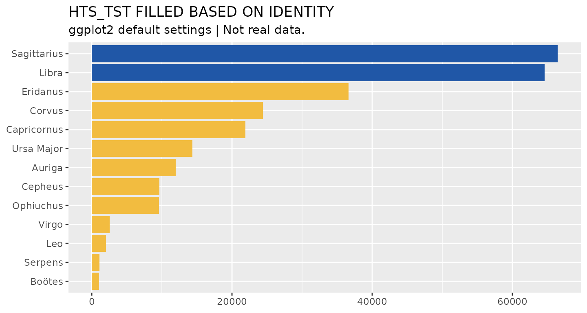

To apply a continuous OHA palette to a visualization, you can use the
[`scale_fill_si()`](https://usaid-oha-si.github.io/glitr/reference/scale_fill_si.md)
or
[`scale_color_si()`](https://usaid-oha-si.github.io/glitr/reference/scale_color_si.md)
function. In the example below, we create a heat map, using
[`geom_tile()`](https://ggplot2.tidyverse.org/reference/geom_tile.html),
to show how testing targets vary across modality.

``` r
hts_hm <- hts %>% 
  filter(period_type == "targets", period == "FY50") %>% 
  group_by(prime_partner_name) %>% 
  mutate(total_targets = sum(value, na.rm = T)) %>% 
  ungroup() %>% 
  mutate(partner_order = fct_reorder(prime_partner_name, total_targets))

hts_hm %>% 
  ggplot(aes(x = modality, y = partner_order, fill = value)) + 
  geom_tile(color = "white") +
  scale_fill_si(palette = "lavender_haze_c", reverse = TRUE) +
  labs(x = NULL, y = NULL, 
       title = "UNIMPRESSIVE HEAT MAP WITH HUNTER CONTINUOUS FILL",
       subtitle = "ggplot2 default settings",
       caption = "Source: glitr package `hts` dummy data")
```

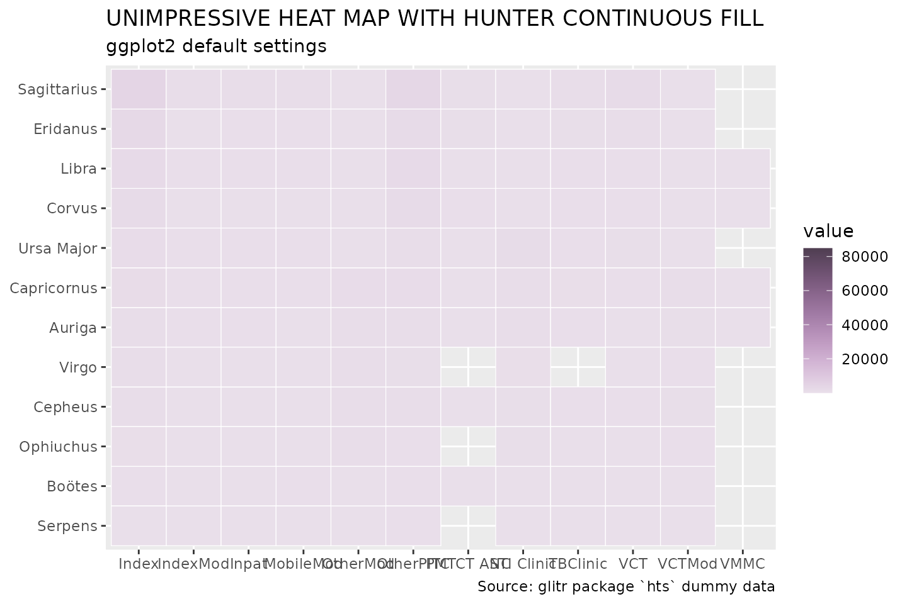

As is, this graphic is not too informative. Everything is a light shade
of `lavender_haze_c`. Why is this the case? If we were to look at the
distribution of the data, we would see that it skews heavily toward 0.
Many targets appear to be on the lower end, but a few outliers are
really mucking up the color encoding. We can do a couple things to make
this graphic more informative. Because the
[`scale_fill_si()`](https://usaid-oha-si.github.io/glitr/reference/scale_fill_si.md)
function takes the `...` argument, we can pass a transformation option
to the plot, as well as define a new set of breaks.

``` r
# Log transform data, clean up legend, apply semi-transparency (alpha) and label
  hts_hm %>% 
    ggplot(aes(x = modality, y = partner_order, fill = value)) + 
    geom_tile(color = "white") +
    scale_fill_si(palette = "lavender_haze_c", alpha = 0.85, trans = "log", 
                  breaks = c(1 * 10^(1:5)), reverse = TRUE,
                  labels = comma,
                  name = "Targets") +
    labs(x = NULL, y = NULL, title = "LOG-TRANSFORMED COLOR ENCODING",
         subtitle = "ggplot2 default settings",
         caption = "Source: glitr package `hts` dummy data"
         ) +
    geom_text(aes(label = ifelse(value > 10000, comma(value), NA_real_)),
              size = 8/.pt, family = "Source Sans Pro", color = "white",
              na.rm = TRUE) +
    scale_x_discrete(guide = guide_axis(n.dodge = 2), position = "top") +
  theme_minimal()
```

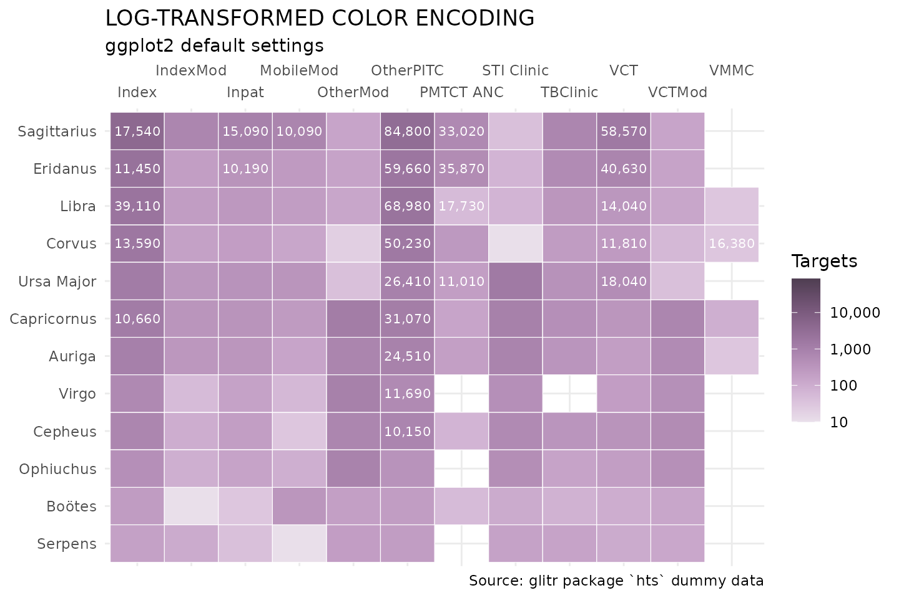

### SI Themes

In order to create visualizations that appear to belong to the same
family ([Think Baldwin
Brothers](https://live.staticflickr.com/4111/5195907338_df50404c30_b.jpg)),
`glitr` includes nine ggplot themes that simplify a plot down to its
core elements. At the base of these themes is the
[`si_style()`](https://usaid-oha-si.github.io/glitr/reference/si_style.md).

``` r
grep("(si_style)", ls('package:glitr'), value = T)
#>  [1] "si_style"             "si_style_map"         "si_style_nolines"    
#>  [4] "si_style_transparent" "si_style_void"        "si_style_xgrid"      
#>  [7] "si_style_xline"       "si_style_xyline"      "si_style_ygrid"      
#> [10] "si_style_yline"
```

We can see how this differs from the default ggplot2 theme by applying
the theme to the plot above.

``` r
p + si_style() +
  labs(subtitle = "si_style_() | Title, subtitle and caption formatted.") 
```

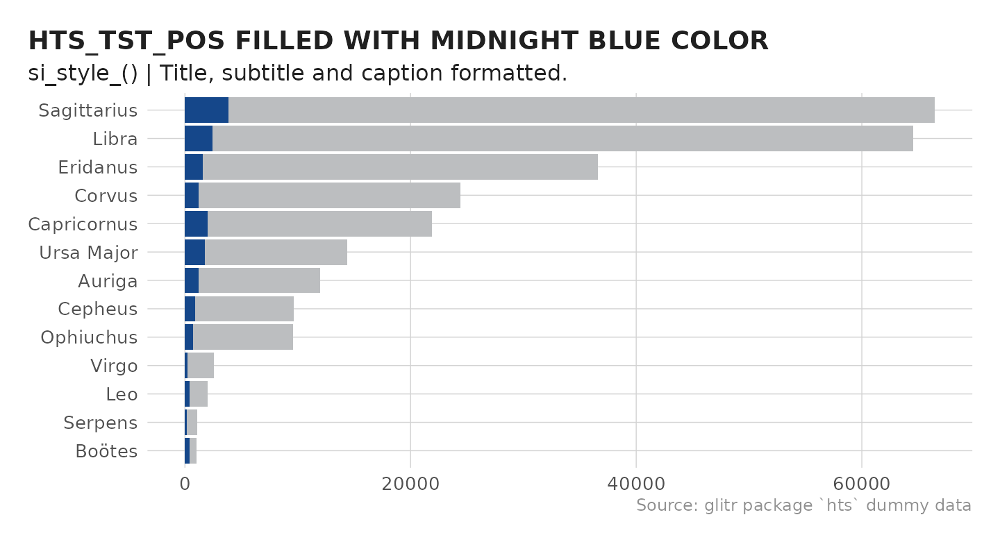

You will notice the si_style strips the background gray color and
converts the grid lines to a light shade of gray. As this plot is
oriented horizontally, we can remove the extra y gridlines by using the
`si_style_xgrid` theme. All of the si themes also come with
pre-formatted titles, subtitles, and captions following the style guild
standards.

``` r
p + 
  si_style_xgrid() + 
  scale_x_continuous(labels = comma) +
  labs(caption = "Source: glitr package `hts` dummy data",
       subtitle = "si_style_xgrid() | Title, subtitle and caption formatted.") +
  coord_cartesian(expand = F) # Move names closer to y-axis
```

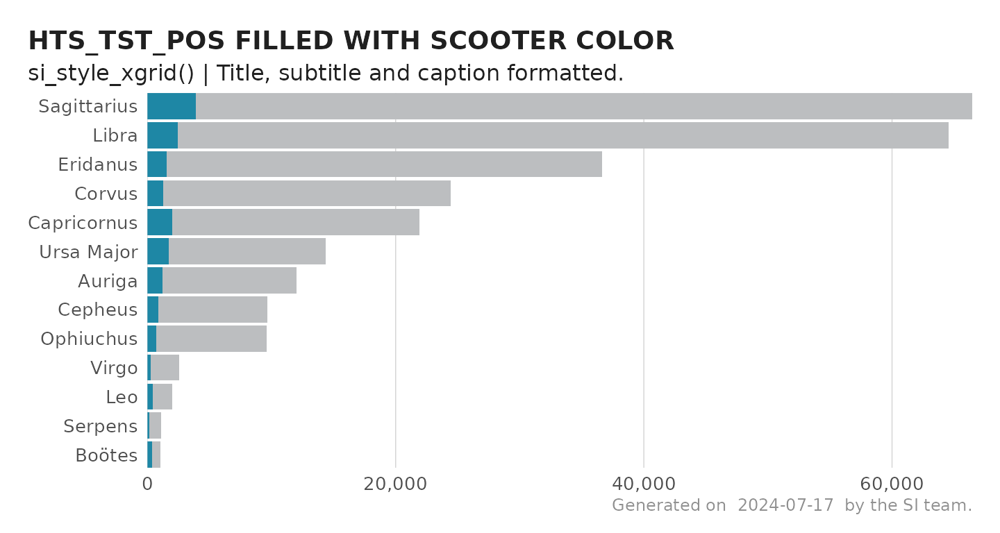

### Comparing Themes

Below is a summary graphic showing all the available SI themes.

``` r

# Create a list of all themes to loop over
  theme_list <- list('si_style()' = si_style(), 
                     'si_style_xline()' = si_style_xline(), 
                     'si_style_xgrid()' = si_style_xgrid(),
                     'si_style_xyline()' = si_style_xyline(), 
                     'si_style_yline()' = si_style_yline(), 
                     'si_style_ygrid()' = si_style_ygrid(), 
                     'si_style_nolines()' = si_style_nolines(), 
                     'si_style_void()' = si_style_void()
                     )

# Custom plot function to incorporate themes
  custom_plot <- function(x) {
    p + {{x}}
  }

# Make all the plots  
  plots <- map2(theme_list, names(theme_list),  ~custom_plot(.x) + 
                  labs(subtitle = paste(.y), title = NULL) +
                  theme(axis.text = element_text(size = 12/.pt))) 
  
# Create a sample map
 hts_map <-  hts_geo %>% 
   ggplot() + 
   geom_sf(aes(fill = prime_partner_name)) + 
   si_style_map() + 
   scale_fill_si(palette = "siei", discrete = T) +
   theme(legend.position = "none") + 
   labs(subtitle = 'si_style_map()')
  
  reduce(plots, `+`) + 
    hts_map +
    plot_annotation(subtitle = "A comparison of si_style() themes",
                    theme = si_style()) +
    plot_layout(ncol = 3)
```

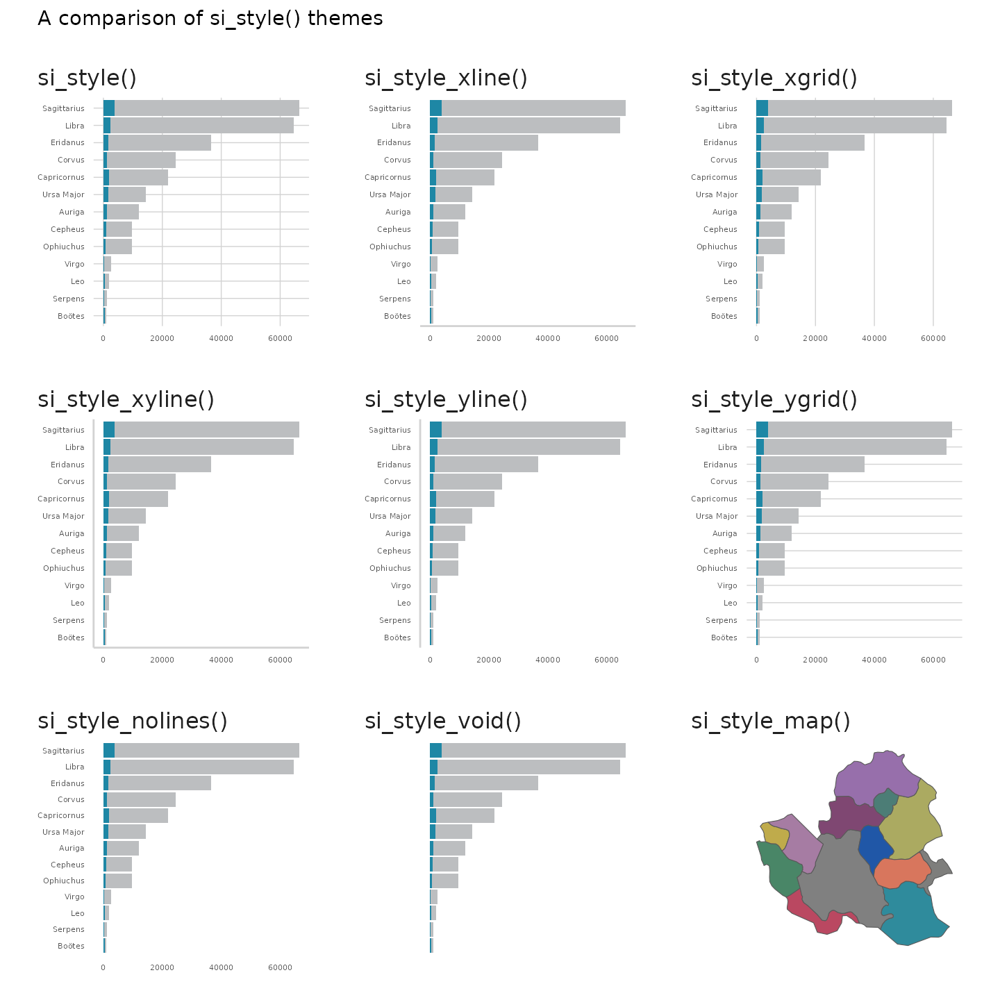
