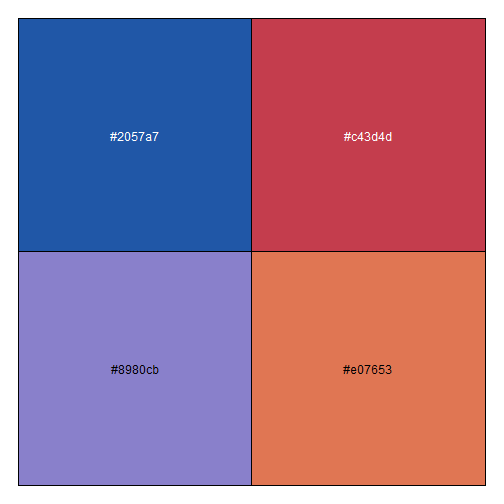

### Introduction

This vignette provides best practices for applying SIEI recommended colors to visualizations using the `glitr` package. 

### Getting Started

To get started, load the standard OHA-SI libraries that are often used in analysis. 

```r
library(tidyverse)
library(glitr)
library(scales)
library(ggtext)
```
The `glitr` package can be divided into three main parts i) colors, that come bundled as objects, ii) si themes, that can be used to quickly apply SI plot defaults, and iii) helper functions, that interpolate palettes or apply palettes to ggplots. We will explore the colors first.

### Colors
A number of pre-defined colors come with the `glitr` package. The set that is probably of most interest is the SIEI recommended colors. As you may recall from the [Data Visualization Style Guild](https://usaid-oha-si.github.io/styleguide/), the SI team has created seven core colors:

 denim  
 old_rose  
 moody_blue    
 burnt_sienna  
 scooter  
 golden_sand   
 genoa  

Any of these colors can be called by simply typing in the name of the color.

```r
show_col(c(denim, old_rose, moody_blue, burnt_sienna))
```



