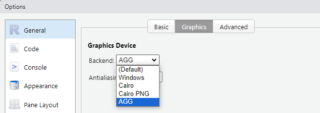

```{r, include = FALSE}
knitr::opts_chunk$set(
  collapse = TRUE,
  eval = FALSE,
  comment = "#>"
)
```

To create standard visualizations across our team, we rely on one of USAID's alternate fonts, Sans Source Pro. This font is not only not native to R, nor is it a standard to Windows.

### Downloading/Installing

Sans Source 3 (formerly Pro) is an open source font available from Google Fonts and from Software Center on USAID GFEs. - To install on your GFE, open Software Center App, click on "Source Sans Pro (Google Web Font)", and then select install. - To install from Google Fonts, navigate to this [link](https://fonts.google.com/specimen/Source+Sans+3) and click the "Download family". After the folder finishes downloading, unzip it.

### Updating your Graphics Device

In order to take advantage of non-native R fonts, you will need to update your graphics device in your Global Options to "AGG".

> Graphics in R are plotted on a *graphics device*. You can manually specify a graphics device or let R use the default device. In an interactive R environment, the default is to use the device that plots graphics on the screen. On Microsoft Windows, the windows device is used." [Joseph Adler - "R in a Nutshell"](https://www.oreilly.com/library/view/r-in-a/9781449377502/ch14s02.html)

To change your graphic device to "AGG", from the menu bar, navigate to Tools > Global Options > General > Graphics > Graphic Device. From there, the Graphic Device selected will likely just be "(Default)." You will need to change it to "AGG".



### Accessing Fonts in R

To use non-native fonts in R, you must load the `systemfonts`, which is installed as a dependency from `glitr`. To use Source Sans 3 typeface with `ggplot2` in R, you will need to load the `systemfonts` library as with any other package at the start of your code.

```{r}
library(ggplot2)
library(systemfonts)
library(glitr)

ggplot(iris, aes(Sepal.Length, y = Sepal.Width, colour = Species)) +
  geom_point() + 
  si_style()

```
